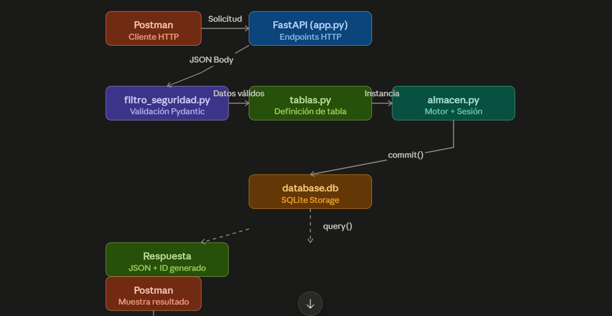
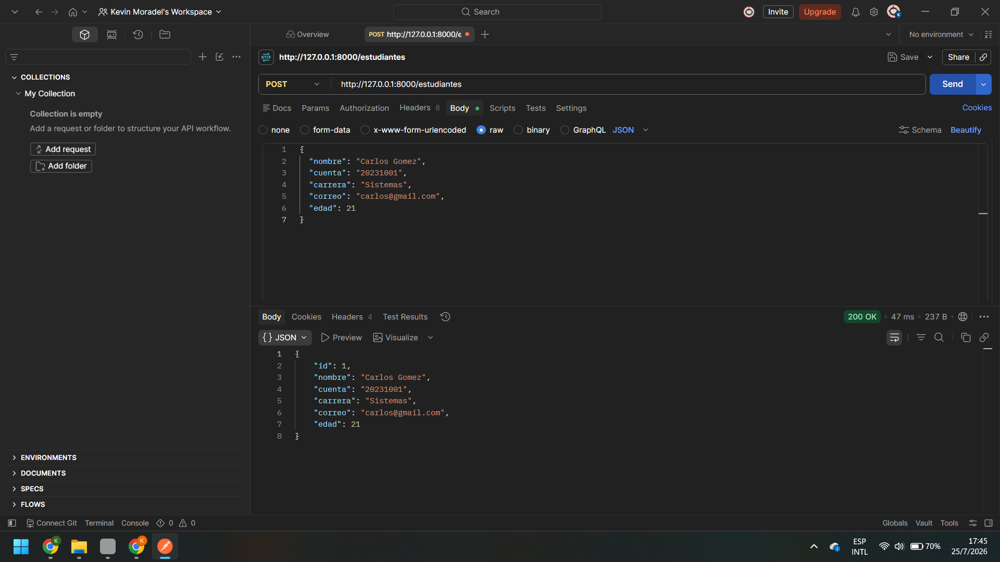
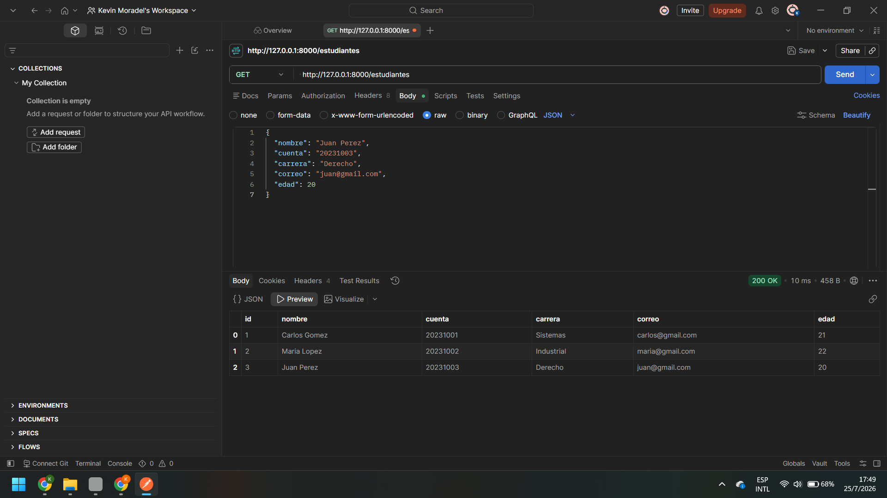
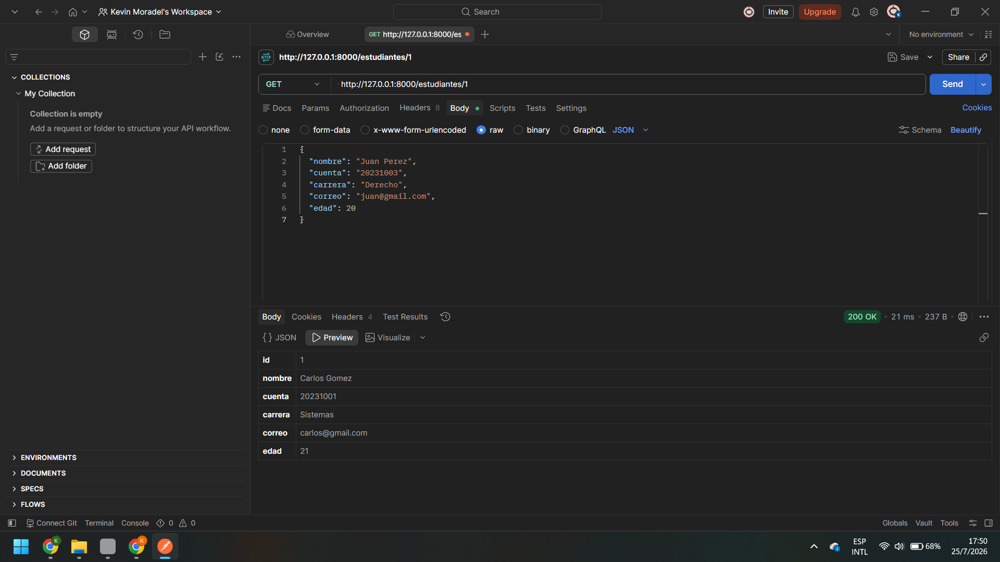
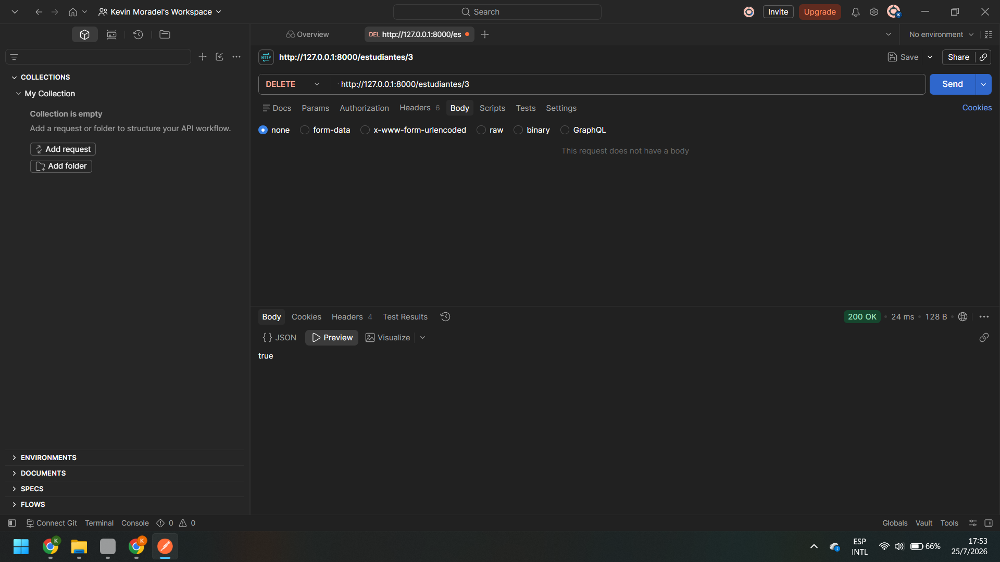

# 📚 API de Gestión de Estudiantes con SQLAlchemy
 
Proyecto de API REST desarrollado en **FastAPI** con **SQLAlchemy** para gestionar información de estudiantes. La API permite crear, leer, actualizar y eliminar registros de estudiantes mediante endpoints HTTP.
 
---
 
## 🌿 Ramas del Proyecto
 
Este repositorio tiene **dos versiones diferentes**:
 
### 🔵 Rama `main`

 Usa **SQLAlchemy ORM**
- Define tablas como clases Python.
- Más seguro y más fácil de mantener
- **Instala dependencias adicionales:** `pip install sqlalchemy`

**Para usar main:**
```bash
pip install -r requirements.txt
```
---

### 🟣 Rama `Version2`
- Usa **SQL directo** con comandos `INSERT`, `SELECT`, `UPDATE`, `DELETE`
- Manejo manual de la base de datos con `sqlite3`
- Ideal para entender cómo funciona SQL por dentro
- **Menos código**, pero más vulnerable a SQL Injection si no se cuida


 
## ⚙️ Cómo Instalar y Ejecutar
 
### Paso 1: Clonar el repositorio
 
```bash
git clone https://github.com/kevinhndz/API_Estudiante.git
cd API_Estudiante
```
 
### Paso 2: Crear el entorno virtual
 
```bash
python -m venv venv
```
 
Activar el entorno virtual:
 
**En Windows:**
```bash
venv\Scripts\activate
```
 
### Paso 3: Instalar las dependencias
 
```bash
pip install -r requirements.txt
```
 
### Paso 4: Ejecutar el servidor
 
```bash
uvicorn app:app --reload
```
 
La API estará disponible en `http://127.0.0.1:8000` 🚀
 
---
 
## 📂 Estructura del Proyecto
 
```
API_Estudiante/
├── app.py               # Endpoints y lógica principal
├── almacen.py           # Conexión a BD y configuración SQLAlchemy
├── tablas.py            # Modelo de la tabla Estudiantes
├── filtro_seguridad.py  # Validación de datos con Pydantic
├── database.db          # Base de datos SQLite
├── requirements.txt     # Dependencias del proyecto
└── img/                 # Capturas de las pruebas
    ├── POST.png
    ├── GET.png
    ├── GET_UNICO.png
    ├── PUT.png
    └── DELETE.png
```
 
---
 
## 📝 Detalles Técnicos
 
### ¿Qué es SQLAlchemy?
 
SQLAlchemy es un ORM (Object-Relational Mapping). En lugar de escribir SQL directamente, defino mis tablas como clases de Python. Eso hace que el código sea más limpio y seguro.
 
### Estructura de Archivos
 
- **almacen.py:** Aquí configuro la conexión a SQLite. El `motor` es el encargado de ejecutar las queries. `abrir_puerta_bd()` es una función que abre y cierra la conexión cada vez que hago una petición.
- **tablas.py:** Defino las columnas de la tabla como atributos de una clase. SQLAlchemy convierte eso automáticamente en una tabla en la BD.
- **filtro_seguridad.py:** Uso Pydantic para validar los datos. `Revision` valida cuando creo o edito, y `RevisonEditada` permite campos opcionales para actualizaciones parciales.
- **app.py:** Los endpoints de FastAPI que reciben peticiones, consultan la BD y devuelven respuestas.
### Operaciones CRUD
 
El proyecto implementa las 4 operaciones básicas:
 
| Operación | Verbo HTTP | Qué hace |
|---|---|---|
| **Crear** | `POST` | Agregar un nuevo estudiante |
| **Leer** | `GET` | Obtener datos de estudiantes |
| **Actualizar** | `PUT` | Modificar un estudiante existente |
| **Eliminar** | `DELETE` | Borrar un estudiante |
 
### Por qué SQLite
 
- **Fácil de usar:** No necesita un servidor externo
- **Portátil:** Todo está en un solo archivo `.db`
- **Perfecto para proyectos pequeños:** Rápido y sin complicaciones
### Seguridad: Prevención de SQL Injection
 
Con SQLAlchemy, no escribo SQL directamente. El ORM se encarga de construir las consultas de forma segura. No hay riesgo de SQL Injection porque los datos nunca se concatenan directamente.
 
```python
# Con SQLAlchemy es automáticamente seguro
base_datos.query(TablaEstudiantes).get(id)
```
 
No necesito placeholders como `?` porque SQLAlchemy ya lo hace por mí.
 
---

## 📸 Mapa Mental de como se Mueven los Datos


 

## 📸 Evidencias de Pruebas en Postman (CRUD)

A continuación se muestran las pruebas de funcionamiento enviadas a los endpoints con sus correspondientes códigos de estado HTTP (`200 OK`):

### 1. Crear Estudiante (`POST /estudiantes`)

Registra un nuevo estudiante enviando los datos requeridos en formato JSON en el cuerpo (`Body`) de la petición.



**Ejemplo de solicitud:**
```json
{
  "nombre": "Carlos Gomez",
  "cuenta": "20231001",
  "carrera": "Sistemas",
  "correo": "carlos@gmail.com",
  "edad": 21
}
```

---

### 2. Consultar Lista General (`GET /estudiantes`)

Obtiene el arreglo completo con todos los estudiantes registrados almacenados en la base de datos.



**Respuesta esperada:** Un arrglo de objetos con todos los estudiantes

---

### 3. Consultar Estudiante por ID (`GET /estudiantes/{id}`)

Filtra y devuelve de forma individual la información del estudiante que coincida con el identificador en la URL.



**Ejemplo:** `GET /estudiantes/1`

**Respuesta:** Objeto JSON con los datos del estudiante específico

---

### 4. Actualizar Estudiante (`PUT /estudiantes/{id}`)

Modifica de forma completa la información del estudiante asociado al ID enviado en el parámetro.


**Ejemplo:** `PUT /estudiantes/3`

**Cambios realizados:**
- Nombre: "Juan Pérez Editado"
- Correo: "juan@yahoo.com"

---

### 5. Eliminar Estudiante (`DELETE /estudiantes/{id}`)

Remueve de forma permanente de la base de datos el registro perteneciente al identificador proporcionado.



**Ejemplo:** `DELETE /estudiantes/3`

**Respuesta:** `true` (confirmación de eliminación exitosa)

---

## 📝 Detalles Técnicos

### ¿Qué es una API?

Una **API** es básicamente un "contrato" entre el servidor y el cliente. Le permite al profesor (o a cualquiera) comunicarse con mi aplicación enviando peticiones HTTP y recibir datos en formato JSON.

### Operaciones CRUD

El proyecto implementa las 4 operaciones básicas:

| Operación | Verbo HTTP | Qué hace |
|---|---|---|
| **Crear** | `POST` | Agregar un nuevo estudiante |
| **Leer** | `GET` | Obtener datos de estudiantes |
| **Actualizar** | `PUT` | Modificar un estudiante existente |
| **Eliminar** | `DELETE` | Borrar un estudiante |

### Por que SQLite

- **Fácil de usar:** No necesita un servidor externo
- **Portátil:** Todo está en un solo archivo `.db`
- **Perfecto para proyectos pequeños:** Rápido y sin complicaciones

### Seguridad: Prevención de SQL Injection

En el archivo `crud.py` usé consultas parametrizadas para evitar ataques:

```python
cursor.execute("SELECT * FROM estudiantes WHERE id = ?", (estudiante_id,))
```

De esta forma, la base de datos trata la entrada como datos, nunca como codigo SQL.

---

## ✅ Lo que Incluye

✔️ 5 endpoints funcionales (POST, GET, GET por ID, PUT, DELETE)  
✔️ Base de datos SQLite integrada  
✔️ Validación de datos con Pydantic  
✔️ Consultas seguras (sin SQL Injection)  
✔️ Capturas de prueba en Postman  

---
# Preguntas y Respuestas del Proyecto


### 1. ¿Cuál es la diferencia entre POST y PUT?

POST es para crear estudiantes nuevos. Cada vez que hago un POST, se crea un registro nuevo y el servidor le asigna un ID automático. PUT es para editar un estudiante que ya existe. Ahí tengo que meter el ID en la URL tipo `/estudiantes/3` para saber cuál voy a modificar.

---

### 2. ¿Por qué la cuenta y el correo se definieron como UNIQUE?

Porque la cuenta es como el número de cédula del estudiante, no puede haber dos iguales. Lo mismo con el correo, cada persona tiene uno diferente. Si alguien intenta crear un estudiante con una cuenta que ya existe, la base de datos rechaza el registro y tira error.

---

### 3. ¿Qué ventaja ofrece SQLite en una práctica de aprendizaje?

Porque SQLite no necesita un servidor aparte corriendo. Toda la BD está en un archivo que puedo llevar de un lado a otro. Es rápido para programas pequeños y para aprender. Si hago un proyecto grande en producción ya usaría PostgreSQL o MySQL, pero para esto SQLite está perfecto.

---

### 4. ¿Qué sucede si se envía una edad de 10 años? Explique el código recibido.

La idea era validar eso con Pydantic. Idealmente configuraría algo así para que solo acepte edades entre 17 y 80. Si se intenta mandar algo fuera de rango, la API devuelve error 422 diciendo que los datos no son válidos.

---

### 5. ¿Por qué no debe concatenarse directamente información del usuario en una consulta SQL?

Ese `?` es importante para la seguridad. Si concateno directo los datos del usuario en la consulta, un atacante puede hacer SQL Injection, que es inyectar código malicioso. Con el `?` la base de datos sabe que es un dato, no código. Así nadie puede meter un comando tipo `DROP TABLE` para borrar todo.

---

### 6. ¿Qué diferencia existe entre el Body superior y el inferior?

Lo que escribo en el Body antes de dar "Send" es lo que envío al servidor. Después el servidor me responde con otro Body. Generalmente me devuelve lo que envié más el ID que generó. Por ejemplo, si envío los datos de Carlos, me devuelve los mismos datos pero con `"id": 1`.

---

### 7. ¿Cuándo se utiliza POST y cuándo PUT?

POST es cuando creo un registro nuevo sin saber qué ID va a tener. La dirección es `/estudiantes` sin ID. PUT es cuando edito algo que ya existe y sé cuál es el ID, entonces voy a `/estudiantes/3` para editar el estudiante número 3.

---

### 8. ¿Qué significa 201 Created?

Es un código HTTP que devuelve el servidor. El 200 OK significa que salió bien pero no creó nada nuevo. El 201 Created significa que salió bien Y además se creó un recurso nuevo. Entonces cuando hago POST debería recibir 201, no 200.

---

### 9. ¿Por qué GET normalmente no necesita Body?

Porque GET es solo para pedir información, no para enviar datos nuevos. Los datos que necesito los meto en la URL, como `/estudiantes/3` o en parámetros como `?nombre=Carlos`. Como no estoy mandando mucho, no necesito Body. Si intentas mandar Body en un GET, el servidor lo ignora.

---

### 10. ¿Qué indica una respuesta 409?

El 409 Conflict aparece cuando intento crear algo que causa conflicto. En mi API, si intento crear un estudiante con una cuenta o correo que ya existe, recibo 409 porque viola el constraint UNIQUE que puse. Otros códigos que manejo son 400 (datos mal), 404 (no existe) y 500 (error del servidor).